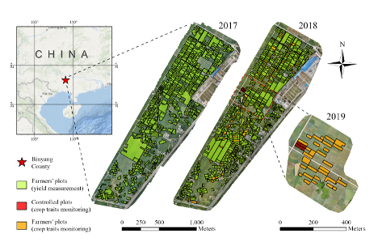

# Binyang Benchmark Dataset 
### Overview
The Bingyang dataset is, to our knowledge, the first UAV dataset specifically designed for crop growth monitoring/modeling and yield mapping. The Binyang Experiments are a series of agricultural experiments conducted during 2017-2019 at a 160-ha double-cropping paddy rice cultivation zone (23°5′52″–23°7′23″ N, 108°57′7″–108°58′34″ E), located in the Wuhua Irrigation District, Binyang County, Nanning City, Guangxi Zhuang Autonomous Region, China. 

Further details can be found in the following manuscript:

> Qi Yang, Jingye Han, Zhuowei Chen, Jin Yu, Yuanyuan Zha, Liangsheng Shi*, 2026. Integrating deep learning, process-based model and UAV data for rice yield mapping: A model-data fusing framework with a benchmark dataset. (*in submission*)

{width="100%"}

### The dataset includes:
-  Intensive crop trait in-situ observations (i.e., meteorological data, above-ground biomass, LAI, and crop phenology).
- Corresponding UAV campaigns (i.e., RGB and multispectral reflectance maps).
- Extensive grain yield measurements.
- Georeferenced plot shpfiles.
- A sub-dataset for paddy rice semantic segmentation.
- Crop trait maps and yield maps predicted by a hybrid model-data fusing framework.
 
### How to download
The dataset (~300GB) is publicly available at https://huggingface.co/datasets/qiyang577/BinyangExperiments/tree/main under the CC BY-SA 4.0 license.

### Visualization of the predictions
- Visualize yield maps 
`Show_yield_maps.ipynb`
- Visualize crop trait maps 
`Show_crop_trait_maps.ipynb`